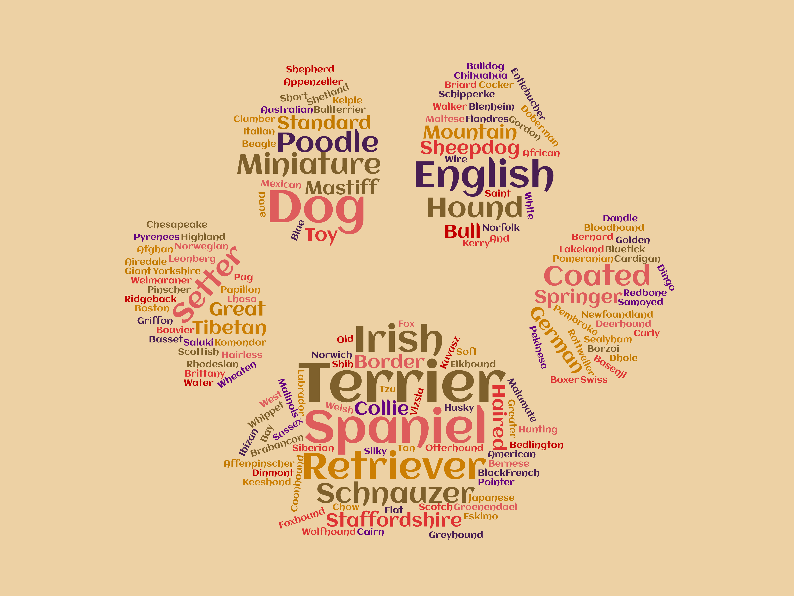
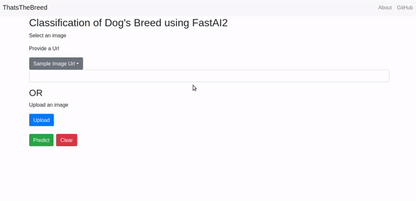

# Dog Breed Classifier WebAPP 

## Demo

The following were used for model **training** (see [requirements.txt](requirements.txt)):    
- fastai2:  version 0.0.30
- PyTorch:  version  1.6
- Python:  version 3.7

The following were used for model **deployment**:    
- Heroku
- Flask:  version 1.1.2
 

## If you want to make your own web app using this repo. Please Read following..
## Table of Contents
1.  [Training the Model](docs/1_training.md) using fastai:  [Dog breed notebook](https://github.com/hiteshhedwig/thatsthebreed/blob/master/notebooks/doggy.ipynb)
2.  [Deploying the App on Heroku](docs/2_heroku_app.md):  our web app is [**thatsthebreed.herokuapp.com**](https://thatsthebreed.herokuapp.com)

Citation:
>Pattaniyil, Nidhin and Shaikh, Reshama, [Deploying Deep Learning Models On Web And Mobile](https://reshamas.github.io/deploying-deep-learning-models-on-web-and-mobile/), 2019

They do incredible job in model deployment. Somehow, its outdated and doesn't work for fastai2. So i have created by version of webapp on the top of their ideas.
If you succesfully able to deploy your webapp. Do remember to cite the original creators. They did the most of hardwork. We should be humbled.
Thanks :)

 

 

 
 
 

 

 

 
 
 

